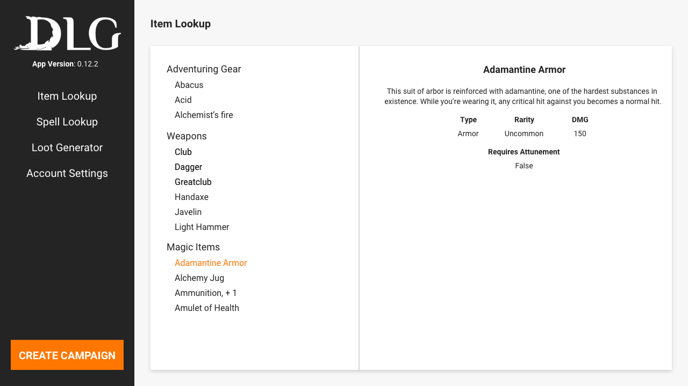
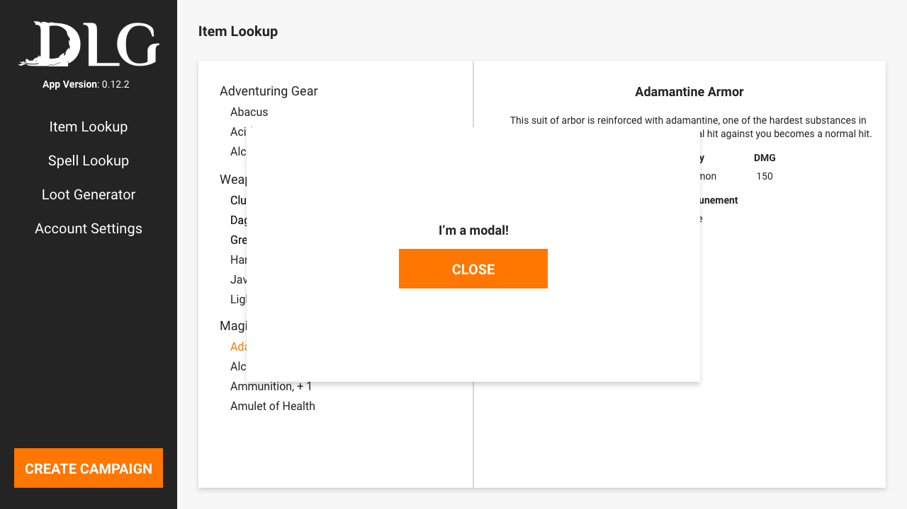

# DLG Software Engineer Tech Test :boom:

Hey! Thanks for applying or even just viewing the tech test ahead of time! This is DLG's Software Engineer tech test. This will test your capability to design and implement a React frontend that connects to a Node backend.

## :rocket: We've already setup:

- React web app with React Router Dom and Axios
  - _It's using Create React App under the hood_
- A `Home` page for to implement the designs on.
- Included Normalize.css so you don't need to worry about resets.
- A prettier config file is setup. Please install the prettier extension to make your life easier.
- TypeScript is setup for both the Node server and the React web app.
  - _If you're not familiar with TypeScript feel free to use `.js` extension and use JavaScript._
- A function and test on the server.
- Implemented the boilerplate to get the node server running.
- The server is setup to handle json files and will include them in the dist/ output.

> **IF YOU DO NOT WANT TO USE THE PROVIDED SETUP, THEN PLEASE FEEL FREE TO ROLL YOUR OWN, WE'RE JUST CONCIOUS OF BOILERPLATE SETUP TIME**

## :computer: What we want you to do:

We want you to implement a screen that is similar to what you might be designing and implementing in the day to day role. The screen has navigation to different areas of the app (these do not need to redirect) and it consumes the `mock_data.json` from a GET endpoint on the server to list the various items. If you click on one of the items, then an item's information will display on the right side of the page.

The GET endpoint for providing the `mock_data.json` must at the least send the json file data back.

As an addition, however you would like, we'd like you to pop up / display a modal when you click on the `CREATE CAMPAIGN` button as seen in the designs. Feel free to use a package to do this.

When you've completed the tech test, we'd like it if you could host this on a Github Repo so that we can go through it and review it.

## :art: Designs

We've supplied the Adobe XD file that we made the designs on which is `dlg-tech-test-designs.xd` in the assets. If you don't want to download Adobe XD or want to work from a 'handover' link, then please look at: https://xd.adobe.com/view/938ed8ab-64b3-44fa-8348-6605cb85bd06-c6dd/specs/ and there's also screenshots at `design_one.png` and `design_two.png`.

We've included the `Roboto.zip` font asset in case you need it but you should be able to get this and use it from Google Fonts as well at: https://fonts.google.com/specimen/Roboto.

The DLG logo has been provided at `dlg_logo.png` and we exported it @2x and @3x in case this is something you wanted to make use of.

## :white_check_mark: Acceptance Criteria

1. The Web App should look as close to the designs as possible.
   - Not everyone is a CSS guru or loves CSS, we see you Backend Devs! If it doesn't look perfect we're not going to reject you on that basis.
1. The Web App should render at `/` and call out to the server and get the `mock_data.json` and display on the page.
1. The Web app should render a navigation bar with links for:
   - Item Lookup
   - Spell Lookup
   - Account Settings
   - Account Settings.
1. The Web App should make use of state to allow a user to select different items from the list and display them on the right side of the pane.
1. The Web App should allow a user to click the CREATE CAMPAIGN button to trigger a modal.
   - The modal should close via the CLOSE button.
1. The Node Server should have a GET endpoint that allows you to request the `mock_data.json` in some fashion. E.g. `/equipment`
1. A Github repo or Zip file sent to `dirtylittlegoblins@gmail.com` where we can view / checkout and load up the code to see your submission.
1. This should be to a work standard of code, we expect you to think about certain situations for the user, what if X happened while browsing.

## :star: Bonus (Only if you have time, we're honestly not bothered)

1. Use TypeScript, we're aware not everyone know's TypeScript so if you use it then that's great, if not no big deal.
1. The Modal should ideally close when clicked outside of the modal, e.g. clicking the page behind.
1. You can have a go at writing some tests if you would like, but we're honestly not too bothered. TDD has it's place, but not when you're doing a tech test for a role.
1. Deploy this to something like Heroku. While we don't use heroku, getting this deployed would help us to review the submission with code side by side the deployment.
1. Anything else... If you want to go away and do something impressive there's nothing stopping you. Equally we respect your time even just reading through this, so don't think we expect a React Native app with animations!

## :thought_balloon: Things to think about for the interview

Hopefully you've managed to complete this tech test, and we really hope it didn't take too long. Once you've submitted it, we'll review it as soon as we can and then we'll invite you to an interview, and if we don't like what we see, we'll give you some feedback on why.

For the interview be thinking about the following:

- TDD / BDD - we didn't ask for it in this test, but we definitely use it.
- React Web App structure choices, how would you implement state
  - What does a component library look like to you? (Hint: The answer isn't as simple as 'Material UI' :wink: )
- Node Server structure choices, how would you implement a database / ORM layer.
  - How might you implement a testing strategy, what does the Testing Pyramid look like to you
